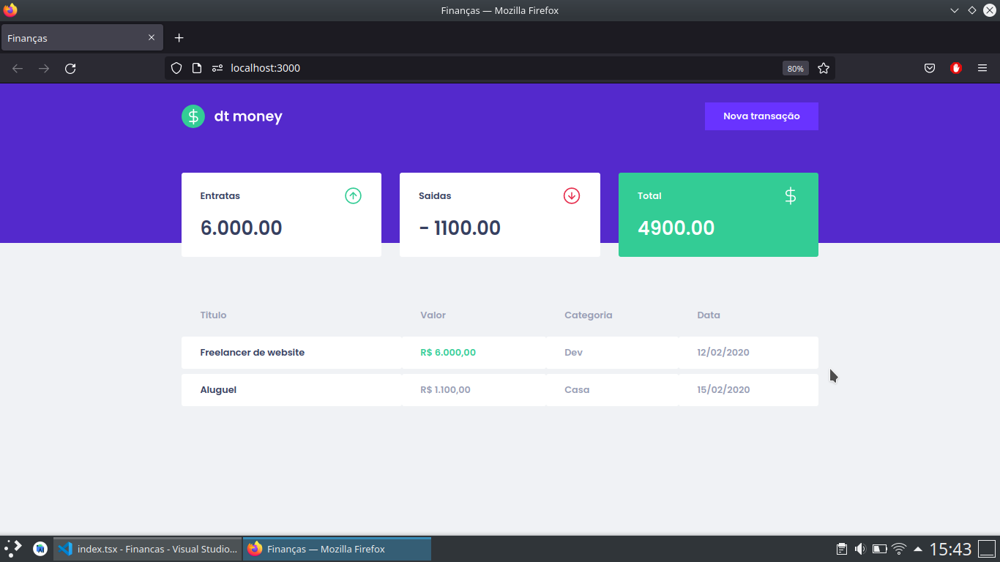
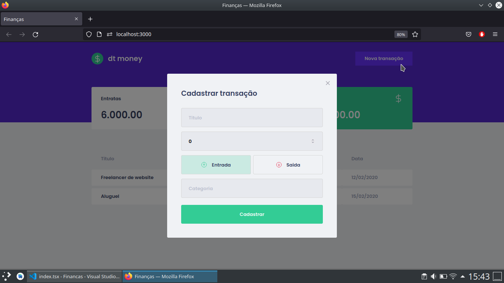

#dt.money

## 💻 Projeto
Aplicação, desenvolvido no curso de Ignite, da Rocketseat, com o objetivo de organizar as finanças pessoais, que já calcula quanto de dinheiro entrou, o que saiu e o total gasto.

## 🌐 Preview

 
    
Tela de Home 

    
    

 

## 🚀 Tecnologias

Esse projeto foi desenvolvido com as seguintes tecnologias:

- ReactJs
- TypeScript
